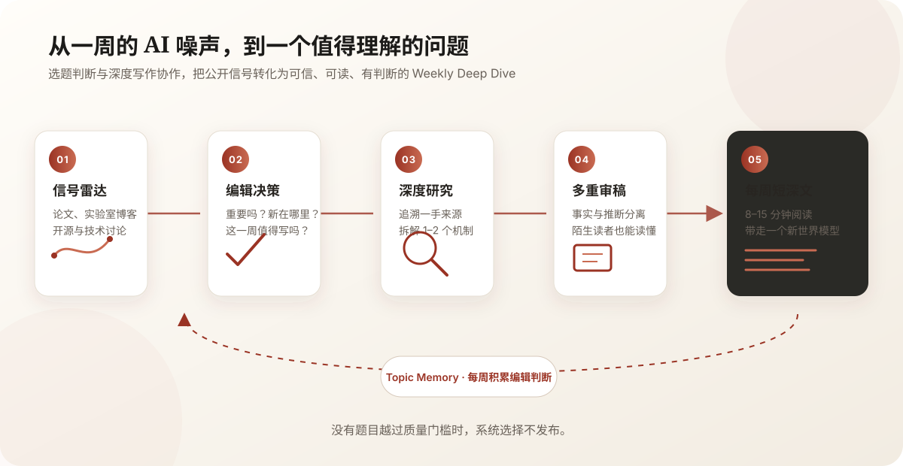

# 深潜 AI 周刊

  

<strong>每周潜入一个 AI 方向的深处。</strong>

  一个自动发现重要 AI 方法与算法话题，并将它写成高质量短深文的 AI 原生编辑部。

---

AI 世界从不缺新闻。真正稀缺的是判断：**什么值得关注，它究竟改变了什么，以及如何把复杂机制讲得让人读懂。**

深潜 AI 周刊每周扫描论文、实验室博客、开源项目与技术讨论，从噪声中选择一个近期出现真实技术增量的问题。随后追溯一手资料、拆解关键机制、核查事实，并用约 8～15 分钟的篇幅写成一篇有判断的 Weekly Deep Dive。

它不是资讯摘要，也不是论文清单。每一期只希望做好一件事：让读者带走一个更新后的技术世界模型。

  

## 我们如何判断一篇文章值得发布

- **选题重要**：它不是短暂热度，而是出现了值得解释的方法、算法或系统变化。
- **机制讲透**：聚焦一个中心问题，深入 1～2 个关键机制，而不是堆砌材料。
- **陌生读者可懂**：不默认读者持续跟踪该方向；必要背景必须先于专业机制出现。
- **证据诚实**：事实能够回到一手来源，作者推断与论文结论清楚分开。
- **像人写作**：有取舍、有克制、有编辑判断，不用模板化结构制造虚假的完整感。

## 一个 AI 原生编辑部

产品由一组职责分明的 AI 编辑协作完成：信号雷达寻找变化，选题编辑判断价值，研究员追溯证据，主笔组织文章，事实编辑与冷启动读者分别检查准确性和可理解性。

每周产生的判断还会沉淀为 Topic Memory，帮助下一期避免重复旧角度，并持续追踪真正值得回答的开放问题。

周频是一种工作节奏，不是发布任务。如果本周没有选题越过质量门槛，系统会选择不发布。

## 开始阅读

- [阅读最新一期](docs/index.html)
- [浏览往期文章](docs/archive.html)

> 当前仍在持续迭代。Lilian Weng 等高质量研究型技术博客是我们在准确性、概念递进与证据习惯上的参考；深潜 AI 周刊追求的是与周频相匹配的深度，而不是把每一期写成完整领域综述。
